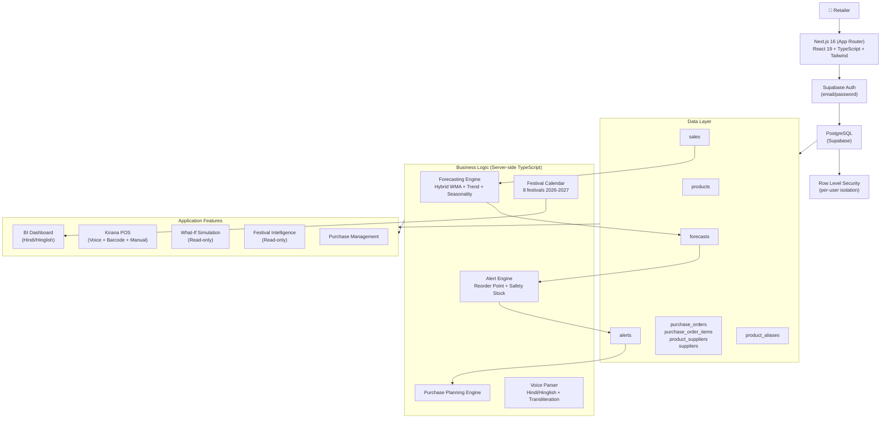

# StockMind AI

**Inventory intelligence for small and mid-sized retailers — helping store owners predict demand, avoid stockouts, reduce overstock, and make smarter purchasing decisions.**

Built for the [HackInMotion Hackathon](https://hackinmotion.com) — solving the challenge:
> *"AI-Powered Inventory & Demand Forecasting System"*

---

## 🚨 The Problem

Small and mid-sized retailers — especially Indian Kirana (general grocery) stores — face a daily balancing act:

- **Stockouts** mean lost sales and disappointed customers
- **Overstock** locks up working capital and creates expiry/wastage risk
- Most store owners rely on memory, manual counts, or spreadsheets
- Demand is not static — it changes over time, varies day-of-week, and spikes around festivals
- Enterprise inventory systems are expensive and require technical expertise

The result: stock decisions are reactive, not data-driven.

---

## 💡 Our Solution

StockMind AI is an end-to-end decision-support system that turns sales history into actionable inventory intelligence.

```
Historical Sales
       ↓
  Demand Forecast  (Hybrid WMA + Trend + Seasonality)
       ↓
  Stock Health     (Days-of-stock vs lead time)
       ↓
  Smart Alerts     (Stockout / Low / Overstock)
       ↓
  Reorder Recommendation  (Quantity + Supplier)
       ↓
  What-If Simulation  (Hypothetical demand scenarios)
       ↓
  Festival Intelligence  (Historical festival uplift)
       ↓
  Retailer Decision
```

StockMind is not a static charts dashboard. Every section flows into the next — forecast demand drives alert thresholds, alert thresholds drive reorder quantities, and the retailer sees a prioritised action list rather than raw numbers.

---

## 🎯 Target Users

- **Small and mid-sized retailers** managing stock manually or in spreadsheets
- **Kirana / general grocery store owners** who want fast, counter-style POS with Hindi/Hinglish UX
- **Retail managers** who need demand visibility without a large enterprise software investment

---

## ✨ Key Features

### 1. 🔐 Secure Authentication
- Email/password sign-up and login via Supabase Auth
- All inventory, sales, forecasts, alerts, and purchase data is **user-isolated** — each user sees only their own data
- Row Level Security (RLS) enforced at the database layer for every table

### 2. 📦 Inventory Management
- Add, edit, and delete products
- Track current stock, price, category, and supplier details
- **Kirana-specific catalog fields:** barcode, brand, unit (piece/packet/kg/litre/etc.), pack size + unit
- **Product aliases** — attach local names and Hindi names to products for search and voice matching
- Shelf life tracking for perishable/FMCG goods

### 3. 💰 Sales Data Pipeline
- **CSV import** with header validation, row-level error reporting, and duplicate prevention
- **Demo data generation** — deterministic synthetic 90-day sales history for testing (5 demand patterns: stable, increasing, decreasing, weekend-spike, periodic-spike)
- **Retail POS sales** — logged directly from the counter via the POS interface
- Sales history view with date-range and product filters

### 4. 📈 Demand Forecasting Engine

> See [Forecasting Approach](#-forecasting-approach) for the full technical breakdown.

- Hybrid statistical model: **Weighted Moving Average + Linear Trend + Weekly Seasonality**
- 7-day rolling forecast per product
- Confidence score (0–100) based on data length, consistency, trend clarity, and seasonality
- Requires minimum 14 sales transactions to produce a forecast
- Forecast results stored in the `forecasts` table and used downstream by the alert engine

### 5. ⚠️ Smart Stock Alerts
- Automatically recalculated on every dashboard load and after stock changes
- Stock statuses: **Out of Stock / Critical / Low / Healthy / Overstock**
- Alert types: `stockout`, `reorder`, `overstock`
- **Reorder point:** `(avg_daily_demand × lead_time_days) + safety_buffer`
- **Safety stock:** uses demand standard deviation (28-day window) with a 95th-percentile statistical formula (`1.65 × σ × √lead_time`)
- **Shelf-life cap:** reorder quantity is capped at `avg_daily_demand × shelf_life_days` to prevent ordering more than can be sold before expiry
- On-order stock (active purchase orders) is factored in to avoid double-ordering
- Alerts deduplicated — existing active alerts are updated, not duplicated

### 6. 🧠 Business Intelligence Dashboard

Kirana-friendly Hindi/Hinglish interface showing:

- **आज की Sale** — today's revenue and units
- **Stock कम है** — count of low/critical/out-of-stock products
- **Aaj Kya Karna Hai?** — prioritised action list from live Phase 7 alerts
- **Aapka Stock** — health distribution bar (Healthy / Low / Critical / Khatam / Overstock)
- **Tez Bikne Wale** — top 5 products by sales volume with demand trend
- **Dheere Bikne Wale** — slow-moving products with capital at risk
- **Kya Mangwana Hai?** — reorder recommendations from alert engine
- **Aane Wali Demand** — forecast trend counts (Increasing / Stable / Decreasing)
- **Expiry / Overstock Risk** — products where days-of-stock exceeds shelf life
- **Purchase Pipeline** — draft/pending purchase order counts and value
- **StockMind ki Salah** — deterministic natural-language insights
- 7 / 30 / 90-day analytics window selector

### 7. 🧪 What-If Demand Simulation

A **read-only hypothetical scenario tool** — actual inventory is never modified.

- Scenario presets: **+10% / +20% / +30%** demand increase, or custom percentage
- Simulation horizon: **7 / 14 / 30 days**
- Per-product projected impact: normal demand vs simulated demand, projected remaining stock, stockout risk, extra units needed
- Aggregate summary: products at risk, total extra units, estimated additional purchase value
- Current vs simulated comparison table with visual progress bars
- Covers all products in the user's inventory (not just top/slow lists)

> The simulation uses the same `salesVolume / days` baseline as the forecasting engine.
> It does **not** modify any database records.

### 8. 🪔 Festival & Seasonal Intelligence

> Directly addresses the hackathon requirement: *"Seasonal & Festival Trend Detection"*

- Year-locked Indian festival calendar for 2026–2027 (8 festivals: Holi, Eid, Raksha Bandhan, Navratri, Dussehra, Diwali, Christmas, New Year)
- All lunar-calendar dates verified from authoritative sources (documented in `src/lib/festivals/calendar.ts`)
- **Upcoming festival countdown** shown on dashboard
- **Historical festival analysis:** for any festival within the last 90 days, compares mean daily sales in the festival window (±14/+7 days) vs the baseline period
- Requires minimum **5 distinct sale days** in each window — shows "History कम है" if insufficient, never invents uplift
- **Festival demand estimate:** `baseline_daily_demand × (1 + historical_uplift%) × festival_window_days`
- **Preparation status:** Stock ठीक है / Stock बढ़ाना चाहिए / Stock-out Risk
- Read-only — no inventory or purchase data is modified

### 9. 🧾 Kirana POS (Point of Sale)

Fast counter-style sales interface:

- **Multi-field search** — name, brand, barcode, or Hindi/local alias
- **Hindi/Hinglish voice input** — Web Speech API (`hi-IN`), continuous + interim results
  - 8-tier product matching: exact name → alias → barcode → brand → normalised Hindi → transliterated
  - Devanagari transliteration (custom zero-dependency character map)
  - Hindi number words (`एक`, `दो`, `तीन`...) and connectors (`और`, `तथा`)
  - Voice quantity **accumulates** on repeat commands (e.g. saying "दो दूध" twice → 4 units)
- **Barcode scanner support** — USB/Bluetooth keyboard-wedge scanners: type barcode + Enter → instant cart add
- Cart with quantity stepper, manual input, stock-limit enforcement, clear cart
- **Atomic checkout** via PostgreSQL PL/pgSQL RPC (`create_retail_sale`):
  - `SELECT ... FOR UPDATE` row locking per product
  - Stock sufficiency validation
  - Inventory deduction + sales record insertion in a single transaction
  - Uses authoritative DB price, not client-supplied price

### 10. 🖨️ Billing & Receipt
- Optional customer name and phone number per sale
- Bill-level discount (validated: non-negative, cannot exceed subtotal)
- Grand total = subtotal − discount
- Post-sale receipt view with itemised bill, subtotal, discount, grand total
- **Browser-native print** (`window.print()`) with print-specific CSS — no PDF library required
- Receipt is UI-only; no separate invoice or receipt table in the database

---

## 🧠 Forecasting Approach

This is the technical core of StockMind. The forecasting engine (`src/lib/forecasting/engine.ts`) uses a **hybrid statistical method** — not a trained machine-learning model.

### Why statistical rather than ML?
- **Deterministic and explainable** — every forecast can be traced back to the sales data
- **Works with limited history** — a Kirana store may have only a few months of data
- **No training pipeline** — no model files, no retraining, no external compute
- **Auditable** — judges and store owners can verify the logic
- **Fast** — runs in-memory on every dashboard load with no external API call

### Input
- Per-product daily sales aggregated from the `sales` table (last 90 days)
- Each product gets an independent forecast

### Step 1 — Daily Demand Preparation
Sales records are aggregated into a 91-point daily demand array (90 days back + today). Missing dates are padded with zero demand.

### Step 2 — Weighted Moving Average (WMA) Baseline
```
WMA(14) = Σ(weight_i × demand_i) / Σ(weight_i)
where weight_i = i + 1  (linear, most-recent day has highest weight)
```
The 14-day WMA produces a recency-weighted baseline daily demand estimate.

### Step 3 — Linear Trend Detection
The last 28 days are split into two halves. The slope is:
```
slope = (mean(second_half) - mean(first_half)) / half_period_days
```
Classification: **Increasing** if `(avg2 - avg1) / avg1 > 8%`, **Decreasing** if `< -8%`, else **Stable**.

### Step 4 — Weekly Seasonality Detection
Day-of-week averages are computed over the full history. If the standard deviation of the 7 daily indices exceeds 0.08 (i.e., meaningfully non-uniform), seasonality is detected and a multiplier index `[Sun..Sat]` is applied to each forecast day.

### Step 5 — 7-Day Forecast Generation
For each of the next 7 days:
```
projected_base = WMA_baseline + (slope × days_ahead)
seasonal_factor = day_of_week_index[forecast_day]
predicted_demand = max(0, round(projected_base × seasonal_factor))
```

### Step 6 — Confidence Score (0–100)
| Factor | Max Points |
|---|---|
| History length (≥90d = 40, ≥60d = 30, ≥28d = 20, ≥14d = 10) | 40 |
| Demand consistency (low coefficient of variation) | 30 |
| Trend clarity (clear direction) | 15 |
| Weekly seasonality detected | 15 |

Minimum 14 sales transactions required; fewer returns `insufficientData: true`.

### Downstream Usage
- Forecast results are stored in the `forecasts` table
- The **alert engine** uses forecast demand to calculate expected demand over `lead_time + replenishment_cycle` days
- **Reorder quantity** = `expected_demand + safety_stock - current_stock`
- **Safety stock** = `1.65 × demand_std_dev × √lead_time_days` (95th percentile, 28-day window)

---

## 🏗️ System Architecture



### Key Data Flow

```
CSV / Retail POS / Manual Entry
          ↓
      sales table
          ↓
  Forecasting Engine (WMA + Trend + Seasonality)
          ↓
     forecasts table
          ↓
   Alert Engine (Reorder Point + Safety Stock)
          ↓
      alerts table
          ↓
  Dashboard → Action List → Purchase Planning
```

---

## 🛠️ Tech Stack

| Layer | Technology |
|---|---|
| Framework | Next.js 16.3.0 (App Router) |
| Language | TypeScript 5 |
| UI | React 19, Tailwind CSS 4 |
| Database | PostgreSQL via Supabase |
| Auth | Supabase Auth (email/password) |
| ORM/Client | `@supabase/supabase-js` + `@supabase/ssr` |
| CSV Parsing | PapaParse 5 |
| Voice Input | Web Speech API (browser-native, `hi-IN`) |
| Charting | Custom SVG (no chart library) |
| Printing | `window.print()` (browser-native) |
| Hosting | Vercel (recommended) / Any Node.js host |

No external AI API, no ML framework, no chart library, no PDF library.

---

## 📊 Database Schema

All tables have Row Level Security enabled. Every table includes `user_id UUID REFERENCES auth.users(id)`.

| Table | Purpose |
|---|---|
| `products` | Product catalog with stock, price, category, supplier details, shelf life, barcode, brand, unit, pack size |
| `product_aliases` | Local / Hindi / alternate names per product for search and voice matching |
| `sales` | All sales transactions — source: `csv`, `demo`, or `retail` |
| `forecasts` | 7-day per-product demand forecasts with confidence scores |
| `alerts` | Active stock health alerts (stockout / reorder / overstock) with recommended quantities |
| `suppliers` | Supplier master — name, contact, phone, email, address |
| `product_suppliers` | Many-to-many product ↔ supplier relationship with purchase price and primary flag |
| `purchase_orders` | Purchase orders with status lifecycle: `draft → ordered → partially_received → received → cancelled` |
| `purchase_order_items` | Line items per purchase order with recommended, ordered, and received quantities |

**Atomic retail sale function:** `create_retail_sale(p_items JSONB)` — a `SECURITY DEFINER` PL/pgSQL function that uses `SELECT ... FOR UPDATE` row locking, validates stock, deducts inventory, and inserts sale records in a single atomic transaction.

---

## 🔐 Security

- **Authentication:** Supabase Auth — sessions managed via HTTP-only cookies using `@supabase/ssr`
- **Row Level Security:** Every table has RLS policies — `SELECT/INSERT/UPDATE/DELETE` scoped to `auth.uid() = user_id`
- **Server-side ownership validation:** All server actions re-verify ownership via explicit DB queries before mutations
- **Atomic POS transaction:** `create_retail_sale` RPC uses `FOR UPDATE` row locks to prevent concurrent overselling
- **Authoritative pricing:** The POS RPC reads price from the DB, not from client payload — prevents price tampering
- No secrets in source code; credentials supplied via environment variables only

---

## 📁 Project Structure

```
src/
├── app/
│   ├── auth/            # Login, signup, logout
│   ├── dashboard/       # BI Dashboard + What-If + Festival Intelligence
│   │   ├── actions.ts   # Server action: fetchDashboardAnalytics()
│   │   ├── dashboard-client.tsx
│   │   └── sales-trend-chart.tsx  # Custom SVG chart
│   ├── inventory/       # Product management
│   ├── sales/           # POS + CSV import + sales history
│   ├── forecasts/       # Forecast management + calculation trigger
│   ├── alerts/          # Alert management + resolve
│   └── purchases/       # Purchase orders + supplier management
├── components/
│   └── DashboardLayout.tsx  # Shared nav sidebar
├── lib/
│   ├── forecasting/
│   │   └── engine.ts    # Hybrid WMA + Trend + Seasonality engine
│   ├── alerts/
│   │   └── engine.ts    # Reorder point + safety stock + status engine
│   ├── purchasing/
│   │   └── engine.ts    # Purchase order calculation helpers
│   ├── festivals/
│   │   └── calendar.ts  # Year-locked Indian festival calendar (2026–2027)
│   └── voice-parser.ts  # Hindi/Hinglish spoken sales parser + transliteration
└── utils/
    └── supabase/        # Supabase client/server/middleware helpers

supabase/
└── migrations/          # All database migrations (schema + RLS + RPC)
```

---

## 🚀 Local Development

### Prerequisites
- Node.js 18+
- A [Supabase](https://supabase.com) project with the migrations applied

### Setup

```bash
# 1. Clone the repository
git clone <repository-url>
cd stockmind

# 2. Install dependencies
npm install

# 3. Create environment file
cp .env.local.example .env.local
# Fill in your Supabase project URL and publishable key (see below)

# 4. Apply database migrations
# In your Supabase project → SQL Editor, run each file in supabase/migrations/ in order

# 5. Start the development server
npm run dev
```

Open [http://localhost:3000](http://localhost:3000).

---

## 🔑 Environment Variables

Create a `.env.local` file with:

```
NEXT_PUBLIC_SUPABASE_URL=your_supabase_project_url
NEXT_PUBLIC_SUPABASE_PUBLISHABLE_KEY=your_supabase_publishable_key
```

Both values are available in your Supabase project → Settings → API.

> ⚠️ Never commit real credentials. The `.env.local` file is in `.gitignore`.

---

## 📈 HackInMotion Requirement Coverage

| # | Requirement | StockMind Implementation | Status |
|---|---|---|---|
| 1 | User Accounts & Authentication | Supabase Auth email/password, per-user data isolation via RLS | ✅ Complete |
| 2 | Inventory Management | Full product CRUD, stock tracking, Kirana catalog fields, aliases, shelf life | ✅ Complete |
| 3 | Sales Data Handling | CSV import with validation, retail POS sales, demo data generation, sales history | ✅ Complete |
| 4 | Demand Forecasting Engine | Hybrid WMA + Linear Trend + Weekly Seasonality, 7-day forecast, confidence score | ✅ Complete |
| 5 | Smart Stock Alerts | Stockout / Low / Critical / Overstock alerts, reorder quantity, safety stock, shelf-life cap | ✅ Complete |
| 6 | Analytics Dashboard | Hindi/Hinglish BI dashboard, today's KPIs, health distribution, fast/slow products, AI insights | ✅ Complete |
| 7 | Database Integration | Supabase + PostgreSQL, 9 tables, full RLS, atomic PL/pgSQL RPC | ✅ Complete |
| 8 | Responsive Clean UI | Tailwind CSS, mobile-responsive layout, dark sidebar, accessible | ✅ Complete |
| 9 | Error Handling | Input validation, graceful empty states, server-side error boundaries, toast notifications | ✅ Complete |
| — | What-If Simulation | Demand scenario tool (+10/20/30/custom%), 7/14/30-day horizon, read-only | ✅ Bonus |
| — | Festival Intelligence | Historical festival uplift analysis, 8 festivals, insufficient-history guard | ✅ Bonus |
| — | Hindi Voice POS | Web Speech API, Devanagari transliteration, 8-tier matching, barcode scanner | ✅ Bonus |

---

## 🎯 Why StockMind Is Different

Most inventory tools show you what happened. StockMind tells you what to do next.

- **Forecast → Alert → Reorder** workflow — each layer is driven by the previous
- **Kirana-native UX** — Hindi/Hinglish labels, voice input in `hi-IN`, local product aliases
- **Voice + Barcode POS** — real counter-speed sales entry, not just data import
- **What-If simulation** — test "what if there's a 20% sales spike?" without touching real data
- **Festival intelligence** — detect historical demand spikes around Indian festivals, not generic seasonality
- **Honest data handling** — no uplift is invented when history is insufficient; confidence scores are transparent

---

## 🧪 Recommended Demo Flow

To see the full problem → solution arc in about 5 minutes:

1. **Login** → auto-redirect to dashboard
2. **Inventory** → add a few products with supplier lead times and shelf life
3. **Sales** → generate demo data (90-day history with 5 demand patterns)
4. **Forecasts** → calculate forecasts → see 7-day demand per product with confidence scores
5. **Alerts** → view automatically generated low-stock / reorder alerts with recommended quantities
6. **Dashboard** → see "Aaj Kya Karna Hai?" action list, stock health, top/slow products
7. **What-If** → set +30% demand, 14-day horizon → see which products run out
8. **Festival** → see upcoming festival, check festival stock preparation status
9. **Sales / POS** → make a retail sale by voice ("दो दूध और तीन कुरकुरे") or barcode scan
10. **Inventory** → confirm stock decreased → **Purchases** → place a reorder

---

## ⚠️ Known Limitations

- **90-day history window:** The forecasting and festival analysis engines use the last 90 days. Forecast confidence improves with more data; very new products will show `insufficientData: true`.
- **Festival calendar is static:** The 2026–2027 festival dates are configured in `src/lib/festivals/calendar.ts`. This file must be updated annually. No live calendar API is used.
- **Festival uplift requires historical overlap:** If no configured festival falls in the last 90 days, festival demand uplift cannot be calculated from history — the system shows the baseline demand estimate only and marks history as insufficient.
- **Web Speech API:** Voice input requires Chrome or Edge; Firefox does not support the Web Speech API.
- **Browser-native receipt printing:** The print layout uses CSS `@media print`. Layout quality depends on the browser's print engine.
- **Single-user per account:** The current schema supports multiple accounts but not shared multi-user access to the same inventory (no role/team model).

---

## 🔮 Future Scope

These are not current features — they represent realistic next steps:

- Extended historical data window for longer-horizon forecasting
- Location-aware festival and cultural event signals
- Weather and local event demand signals
- Multi-store / branch inventory management
- Supplier integration for automated purchase orders
- Advanced ML-based forecasting (e.g. Prophet, LightGBM) once sufficient training data exists
- Price optimisation and margin analysis
- Camera-based barcode scanning on mobile
- WhatsApp / SMS reorder alerts

---

## 📄 Hackathon Deliverables

| File | Status |
|---|---|
| `README.md` | ✅ This file |
| `supabase/migrations/` | ✅ All schema migrations |
| Source code | ✅ `src/` |

---

## 🛠️ Development Commands

```bash
npm run dev      # Start development server (http://localhost:3000)
npm run build    # Production build
npm run start    # Start production server
npm run lint     # Run ESLint
```

---

*Built with ❤️ for HackInMotion — StockMind AI*
