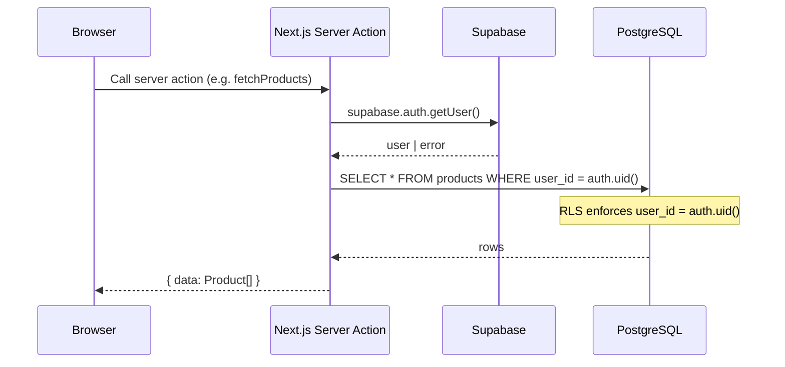
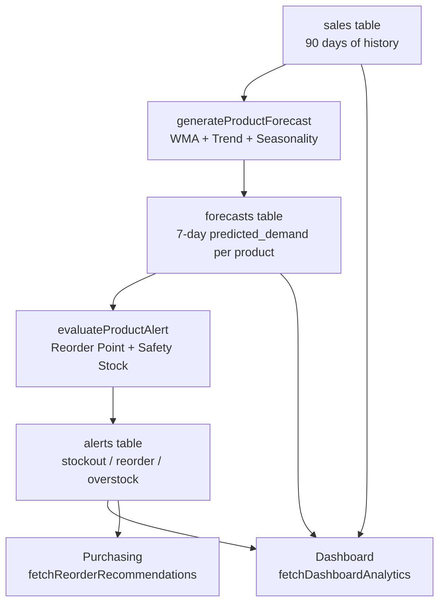
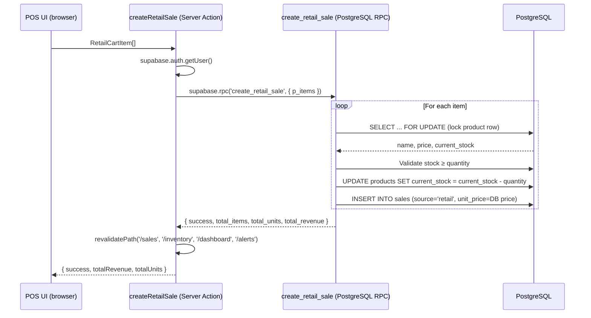

# StockMind AI — API & Data Interface Documentation

> **Architecture note:** StockMind is a Next.js 16 App Router application. There are no traditional REST endpoints. All server-side business logic is exposed through **Next.js Server Actions** (`'use server'` functions) and one **PostgreSQL RPC** function. This document describes every actual server-side interface in the application.

---

## Table of Contents

1. [Architecture Overview](#1-architecture-overview)
2. [Authentication](#2-authentication)
3. [Inventory — Server Actions](#3-inventory--server-actions)
4. [Sales — Server Actions](#4-sales--server-actions)
5. [Atomic Retail Sale RPC](#5-atomic-retail-sale-rpc)
6. [Forecasting — Engine & Server Actions](#6-forecasting--engine--server-actions)
7. [Alerts — Server Actions](#7-alerts--server-actions)
8. [Purchasing — Server Actions](#8-purchasing--server-actions)
9. [Dashboard Analytics — Server Action](#9-dashboard-analytics--server-action)
10. [Festival Intelligence](#10-festival-intelligence)
11. [POS Voice & Barcode (Client-side)](#11-pos-voice--barcode-client-side)
12. [Billing & Receipt (Client-side)](#12-billing--receipt-client-side)
13. [Error Handling](#13-error-handling)
14. [Security](#14-security)
15. [Data Flow Diagrams](#15-data-flow-diagrams)
16. [Response/Error Examples](#16-responseerror-examples)
17. [Database Tables](#17-database-tables)
18. [No External AI API](#18-no-external-ai-api)

---

## 1. Architecture Overview

```
Browser (React 19 + Next.js 16)
        │
        │  Server Actions ('use server' functions)
        │  — Called directly from React components via Next.js RPC mechanism
        │  — Not REST endpoints; no HTTP path routing
        │
        ▼
Next.js App Router (Node.js runtime)
        │
        │  Supabase client (@supabase/ssr)
        ▼
Supabase (PostgreSQL)
        │
        ├── auth.users          (Supabase Auth)
        ├── Row Level Security  (per-user data isolation)
        └── create_retail_sale  (PL/pgSQL SECURITY DEFINER RPC — atomic POS transaction)
```

### Server Actions vs PostgreSQL RPC

| Type | How invoked | When used |
|---|---|---|
| **Next.js Server Action** | Called from React components as async TypeScript functions | All CRUD, analytics, forecasting, alerts, purchasing |
| **PostgreSQL RPC** (`create_retail_sale`) | Called via `supabase.rpc('create_retail_sale', { p_items })` inside a Server Action | POS checkout only — requires atomicity + row locking |

---

## 2. Authentication

StockMind uses **Supabase Auth** with email/password. Sessions are managed via HTTP-only cookies using `@supabase/ssr`.

### Server Actions (`src/app/auth/actions.ts`)

#### `login(formData: FormData)`
- **Purpose:** Authenticates an existing user
- **Parameters:** `email: string`, `password: string` (from FormData)
- **Validation:** Both fields required
- **On success:** Calls `revalidatePath('/', 'layout')` then `redirect('/dashboard')`
- **On failure:** Returns `{ error: string }`
- **Mechanism:** `supabase.auth.signInWithPassword({ email, password })`

#### `signup(formData: FormData)`
- **Purpose:** Creates a new user account
- **Parameters:** `email: string`, `password: string` (from FormData)
- **Validation:** Both fields required
- **On success:** Redirects to `/dashboard`
- **On failure:** Returns `{ error: string }`
- **Mechanism:** `supabase.auth.signUp({ email, password })`

#### `logout()`
- **Purpose:** Signs out the current user
- **Mechanism:** `supabase.auth.signOut()` → redirect to `/auth/login`

### Session & Identity

All authenticated server actions call `supabase.auth.getUser()` at the start. If the session is missing or invalid, `{ error: 'Unauthorized. Please log in.' }` is returned immediately. The authenticated `user.id` is used in every database query to enforce per-user data isolation — both directly (`.eq('user_id', user.id)`) and through Supabase Row Level Security policies.

---

## 3. Inventory — Server Actions

**File:** `src/app/inventory/actions.ts`

All actions require an authenticated session. RLS policies additionally enforce that each user can only access their own records.

### `fetchProducts()`
- **Purpose:** Fetch all products for the authenticated user, ordered by name
- **Returns:** `{ data?: Product[], error?: string }`
- **Tables:** `products`

### `addProduct(formData: FormData)`
- **Purpose:** Create a new product
- **Parameters (from FormData):**

| Field | Type | Required | Notes |
|---|---|---|---|
| `name` | string | ✅ | Non-empty |
| `category` | string | ✅ | Non-empty |
| `current_stock` | integer | ✅ | ≥ 0 |
| `price` | decimal | ✅ | ≥ 0 |
| `supplier_name` | string | ❌ | Defaults to `''` |
| `supplier_lead_time_days` | integer | ✅ | ≥ 0 |
| `shelf_life_days` | integer | ❌ | > 0 if provided |
| `barcode` | string | ❌ | Kirana catalog field |
| `brand` | string | ❌ | Kirana catalog field |
| `unit` | string | ❌ | Must be one of: `piece, packet, box, bottle, kg, gram, litre, ml, dozen` |
| `pack_size` | decimal | ❌ | > 0; requires `pack_size_unit` |
| `pack_size_unit` | string | ❌ | One of: `gram, kg, ml, litre, piece` |

- **Returns:** `{ success: true, productId: string }` or `{ error: string }`
- **Tables:** `products` (INSERT)
- **Revalidates:** `/inventory`

### `updateProduct(id: string, formData: FormData)`
- **Purpose:** Update an existing product (same fields as `addProduct`)
- **Security:** RLS ensures only the owner's records are updated (`.eq('user_id', user.id)` implicit via RLS)
- **Returns:** `{ success: true }` or `{ error: string }`
- **Tables:** `products` (UPDATE)
- **Revalidates:** `/inventory`

### `deleteProduct(id: string)`
- **Purpose:** Delete a product by ID
- **Security:** RLS restricts deletion to owner's records
- **Returns:** `{ success: true }` or `{ error: string }`
- **Tables:** `products` (DELETE)
- **Revalidates:** `/inventory`

### `fetchAllAliases()`
- **Purpose:** Fetch all product aliases for the authenticated user (used for multi-language search)
- **Returns:** `{ data?: ProductAlias[], error?: string }`
- **Tables:** `product_aliases`

### `addAlias(productId: string, alias: string, language?: string)`
- **Purpose:** Add a local/Hindi alias to a product
- **Validation:** Alias must be non-empty; product ownership verified via explicit DB query before insert
- **Returns:** `{ success: true, data: ProductAlias }` or `{ error: string }`
- **Tables:** `product_aliases` (INSERT), `products` (ownership check)
- **Revalidates:** `/inventory`

### `deleteAlias(aliasId: string)`
- **Purpose:** Delete a product alias
- **Security:** Ownership enforced via `.eq('user_id', user.id)` + RLS
- **Returns:** `{ success: true }` or `{ error: string }`
- **Tables:** `product_aliases` (DELETE)
- **Revalidates:** `/inventory`

### Types

```typescript
interface Product {
  id: string
  user_id: string
  name: string
  category: string
  current_stock: number
  price: number
  supplier_name: string
  supplier_lead_time_days: number
  shelf_life_days?: number | null
  barcode?: string | null
  brand?: string | null
  unit?: string | null
  pack_size?: number | null
  pack_size_unit?: string | null
  created_at: string
  updated_at: string
  aliases?: ProductAlias[]
}

interface ProductAlias {
  id: string
  user_id: string
  product_id: string
  alias: string
  language: string | null
  created_at: string
}
```

---

## 4. Sales — Server Actions

**File:** `src/app/sales/actions.ts`

### `fetchSalesData()`
- **Purpose:** Fetch all sales for the authenticated user, joined with product names, ordered by date descending
- **Returns:**
```typescript
{
  data?: Sale[]
  stats?: { totalRecords: number; totalUnits: number; totalRevenue: number }
  error?: string
}
```
- **Tables:** `sales` (joined with `products`)

### `createRetailSale(items: RetailCartItem[])`
- **Purpose:** Execute an atomic POS checkout — delegates to the `create_retail_sale` PostgreSQL RPC
- **Parameters:**
```typescript
items: Array<{ product_id: string; quantity: number }>
```
- **Returns:**
```typescript
{ success: true; totalItems: number; totalUnits: number; totalRevenue: number }
// or
{ error: string }
```
- **Revalidates:** `/sales`, `/inventory`, `/dashboard`, `/alerts`
- **See:** [Section 5 — Atomic Retail Sale RPC](#5-atomic-retail-sale-rpc) for full transaction details

### `importSales(salesList)`
- **Purpose:** Bulk-import historical sales from a validated CSV
- **Parameters:**
```typescript
salesList: Array<{
  product_id: string
  sale_date: string   // ISO date string
  quantity: number
  unit_price: number
}>
```
- **Deduplication:** Fetches existing `source='csv'` sales in the same date range; compares by composite key `product_id + sale_date + quantity + unit_price`; skips exact duplicates
- **Returns:**
```typescript
{ success: true; importedCount: number; skippedCount: number }
// or
{ error: string }
```
- **Tables:** `sales` (SELECT for deduplication, INSERT)
- **Revalidates:** `/sales`

### `generateDemoSales(products: Array<{ id, name, price }>)`
- **Purpose:** Generate deterministic 90-day demo sales history for all provided products
- **Algorithm:** Seeded LCG pseudo-random generator (seed = hash of `product.id`). Each product is assigned one of 5 demand patterns: stable, increasing, decreasing, weekend-spike, periodic-spike
- **Behaviour:** Deletes existing `source='demo'` records for the user first, then batch-inserts new records (500 per chunk)
- **Returns:** `{ success: true; message: string }` or `{ error: string }`
- **Tables:** `sales` (DELETE, INSERT)
- **Revalidates:** `/sales`

### Types

```typescript
interface Sale {
  id: string
  user_id: string
  product_id: string
  sale_date: string         // ISO timestamp
  quantity: number
  unit_price: number
  source: 'csv' | 'demo' | 'retail'
  created_at: string
  product_name?: string     // joined from products table
}

interface RetailCartItem {
  product_id: string
  quantity: number
}
```

---

## 5. Atomic Retail Sale RPC

**File:** `supabase/migrations/20260814000001_create_retail_sale_rpc.sql`

This is the **authoritative transaction handler for POS checkout**. It is a PostgreSQL PL/pgSQL function executed via `supabase.rpc('create_retail_sale', { p_items })`.

### Signature

```sql
CREATE OR REPLACE FUNCTION public.create_retail_sale(p_items JSONB)
RETURNS JSONB
LANGUAGE plpgsql
SECURITY DEFINER
```

### Input

```json
[
  { "product_id": "uuid", "quantity": 2 },
  { "product_id": "uuid", "quantity": 1 }
]
```

### Transaction Steps (executed atomically)

1. **Authentication check** — `auth.uid()` is called inside the function. If null, raises `EXCEPTION 'Unauthorized.'`
2. **Input validation** — if `p_items` is null or empty, raises `EXCEPTION 'Cart is empty.'`
3. **For each item in the cart:**
   a. Validate `quantity > 0`
   b. `SELECT name, price, current_stock FROM products WHERE id = product_id AND user_id = auth.uid() FOR UPDATE` — acquires a row-level lock on the product; prevents concurrent overselling
   c. If product not found or wrong owner: raises `EXCEPTION 'Product not found or access denied.'`
   d. If `current_stock < quantity`: raises `EXCEPTION 'Insufficient stock for "..."'`
   e. `UPDATE products SET current_stock = current_stock - quantity` — deducts inventory
   f. `INSERT INTO sales (user_id, product_id, sale_date, quantity, unit_price, source)` — records the sale using `v_db_price` (the price read from the database, **not** from the client payload) and `source = 'retail'`
4. Accumulates running totals: `total_items`, `total_units`, `total_revenue`

### Return

```json
{
  "success": true,
  "total_items": 2,
  "total_units": 3,
  "total_revenue": 150.00
}
```

### Rollback

If any exception is raised at any step, PostgreSQL automatically rolls back the entire transaction. No partial stock deductions or partial sale records are committed.

### Security Note

- `SECURITY DEFINER` — runs with the permissions of the function owner
- Product price is read from `products.price` inside the function; the client cannot influence pricing
- `FOR UPDATE` row lock prevents two simultaneous POS checkouts from selling the same stock to different customers

---

## 6. Forecasting — Engine & Server Actions

### 6.1 Forecasting Engine (`src/lib/forecasting/engine.ts`)

> StockMind uses a **hybrid statistical model** — not a machine-learning model. No model training, no external API, no pre-trained weights. The forecast is fully deterministic and computed at runtime from the user's own sales history.

#### Model identifier: `hybrid-wma-trend-seasonality-v1`

#### `generateProductForecast(productId, sales, historyDays = 90)`

**Inputs:**
- `productId: string`
- `sales: Array<{ sale_date: string; quantity: number }>` — the product's sales history
- `historyDays: number` — defaults to 90

**Step-by-step algorithm:**

**Step 1 — Daily demand preparation (`prepareDailyDemand`)**
Sales records are aggregated into a daily demand array spanning `historyDays` days. Missing dates are padded with zero demand.

**Step 2 — Insufficient data check**
If fewer than 14 sales transactions exist, returns `{ insufficientData: true, forecastList: [] }`. No forecast is produced.

**Step 3 — Weighted Moving Average baseline (`calculateWeightedMovingAverage`)**
```
WMA(14) = Σ(weight_i × demand_i) / Σ(weight_i)
weight_i = i + 1   (linear, oldest day = 1, most recent = 14)
```

**Step 4 — Linear trend detection (`calculateTrend`)**
```
analysisPeriod = min(28, history_length)
avg1 = mean(first_half_of_last_28_days)
avg2 = mean(second_half_of_last_28_days)
slope = (avg2 - avg1) / (analysisPeriod / 2)

if (avg2 - avg1) / avg1 > 0.08  → Increasing
if (avg2 - avg1) / avg1 < -0.08 → Decreasing
else                              → Stable
```

**Step 5 — Day-of-week seasonality (`calculateWeeklySeasonality`)**
For each day of the week (Sun–Sat), the average demand is computed. The 7-element seasonality index array is applied only if `std_dev(indices) > 0.08`; otherwise uniform indices (1.0) are used.

**Step 6 — 7-Day forecast generation**
For each of the next 7 days:
```
projected_base = WMA_baseline + (slope × days_ahead)
seasonal_factor = day_of_week_index[forecast_date.getDay()]
predicted_demand = max(0, round(projected_base × seasonal_factor))
```

**Step 7 — Confidence score (`calculateConfidenceScore`)**

| Factor | Max Points |
|---|---|
| History length: ≥90d = 40, ≥60d = 30, ≥28d = 20, ≥14d = 10 | 40 |
| Demand consistency (low coefficient of variation) | 30 |
| Clear trend direction | 15 |
| Weekly seasonality detected | 15 |
| **Total** | **100** |

Bounded to [10, 100].

**Returns:** `EngineSummary`
```typescript
interface EngineSummary {
  productId: string
  insufficientData: boolean
  daysOfHistory: number
  trend: 'Increasing' | 'Stable' | 'Decreasing'
  confidenceScore: number        // 0–100
  explanation: string            // human-readable
  forecastList: ForecastResult[] // 7 entries if not insufficientData
  historicalDemand: DailyDemand[]
}

interface ForecastResult {
  productId: string
  forecastDate: string           // YYYY-MM-DD
  predictedDemand: number        // rounded integer ≥ 0
  confidenceScore: number
  modelVersion: string           // 'hybrid-wma-trend-seasonality-v1'
}
```

---

### 6.2 Forecasting Server Actions (`src/app/forecasts/actions.ts`)

#### `fetchForecastsData()`
- **Purpose:** Fetch all stored forecast records for the authenticated user, joined with product names, ordered by forecast date
- **Returns:** `{ data?: ForecastRecord[], error?: string }`
- **Tables:** `forecasts` (joined with `products`)

#### `calculateAllForecasts(products: ProductSimple[])`
- **Purpose:** Run the forecasting engine for all provided products and persist results
- **Algorithm:**
  1. Fetches all of the user's sales history in one batch query
  2. Groups sales by product in-memory
  3. Calls `generateProductForecast(product.id, productSales, 90)` for each product
  4. Deletes existing forecast records for these products with `model_version = 'hybrid-wma-trend-seasonality-v1'`
  5. Batch-inserts new forecast records
- **Returns:**
```typescript
{
  success: true
  summaries: ProductForecastDetails[]  // one per product, includes insufficientData flag
}
// or
{ error: string }
```
- **Tables:** `forecasts` (DELETE + INSERT), `sales` (SELECT)
- **Revalidates:** `/forecasts`, `/dashboard`

---

## 7. Alerts — Server Actions

**File:** `src/app/alerts/actions.ts`

### `fetchAlerts()`
- **Purpose:** Fetch all alerts (resolved and unresolved) for the authenticated user, joined with product data, ordered by creation date descending
- **Returns:** `{ data?: DBAlertRecord[], error?: string }`
- **Tables:** `alerts` (joined with `products`)

### `resolveAlert(alertId: string)`
- **Purpose:** Mark an alert as resolved
- **Security:** `.eq('user_id', user.id)` ensures only the owner can resolve their own alerts
- **Returns:** `{ success: true }` or `{ error: string }`
- **Tables:** `alerts` (UPDATE `resolved = true`)
- **Revalidates:** `/alerts`, `/dashboard`

### `calculateAndStoreAlerts()`
- **Purpose:** Full alert recalculation cycle for all of the user's products. Called automatically on every dashboard load and after stock-changing operations.
- **Algorithm:**
  1. Fetch all products, sales history, and existing forecasts
  2. Fetch active purchase orders (draft/ordered/partially_received) to determine on-order stock
  3. For each product: `evaluateProductAlert({ currentStock: product.current_stock + onOrderQty, ... })` — on-order stock is added to prevent over-ordering
  4. Compare computed alert status against existing active (unresolved) alerts:
     - If product is healthy → resolve existing alerts
     - If alert type unchanged → update message/severity/recommended_quantity on existing alert
     - If alert type changed → resolve old, insert new
     - Duplicates are deduplicated
- **Returns:**
```typescript
{
  success: true
  analyzedCount: number
  insertedCount: number
  updatedCount: number
  resolvedCount: number
}
// or
{ error: string }
```
- **Tables:** `products`, `sales`, `forecasts`, `alerts`, `purchase_order_items`, `purchase_orders`

### Alert Message Format

The `message` field in the `alerts` table is a JSON string:
```json
{
  "reason": "human-readable explanation",
  "currentStock": 12,
  "avgDailyDemand": 4.2,
  "leadTimeDays": 3,
  "shelfLifeDays": 30,
  "replenishmentCycleDays": 7,
  "expectedDemand": 42,
  "safetyStock": 8,
  "maxSellableDemand": 126,
  "recommendedQty": 38
}
```

### Alert Engine Functions (`src/lib/alerts/engine.ts`)

| Function | Purpose |
|---|---|
| `calculateAverageDailyDemand(salesHistory, windowSize=28)` | Mean daily demand over last 28 days |
| `calculateDaysOfStockRemaining(currentStock, avgDailyDemand)` | `currentStock / avgDailyDemand`; returns 999 if demand=0 |
| `calculateReorderPoint(avgDailyDemand, leadTimeDays)` | `(avgDailyDemand × leadTimeDays) + max(5, leadTimeDemand × 0.3)` |
| `calculateDemandStandardDeviation(salesHistory, avgDailyDemand, windowSize=28)` | Sample stddev over distinct sale days; requires ≥3 distinct days |
| `calculateDetailedReorder(currentStock, avgDailyDemand, leadTimeDays, salesHistory, forecasts, shelfLifeDays?)` | Full reorder calculation: replenishment cycle, expected demand, safety stock (`1.65 × σ × √leadTime`), shelf-life cap |
| `calculateStockStatus(currentStock, daysRemaining, leadTimeDays, shelfLifeDays?)` | Returns: `out_of_stock`, `critical`, `low`, `healthy`, or `overstock` |
| `evaluateProductAlert(input)` | Main evaluator; calls all of the above and returns `AlertEngineResult` |

---

## 8. Purchasing — Server Actions

**File:** `src/app/purchases/actions.ts`

### Supplier Management

#### `fetchSuppliers()`
- Returns all suppliers for the authenticated user, ordered by name
- `→ { data?: Supplier[], error?: string }`

#### `addSupplier(formData: FormData)`
- Fields: `name` (required), `contact_name`, `phone`, `email`, `address`, `notes` (all optional)
- `→ { success: true }` or `{ error: string }`
- Tables: `suppliers` (INSERT)

#### `updateSupplier(id: string, formData: FormData)`
- Same fields as `addSupplier`
- `→ { success: true }` or `{ error: string }`

#### `deleteSupplier(id: string)`
- Blocked if the supplier has active purchase orders (draft/ordered/partially_received)
- `→ { success: true }` or `{ error: string }`

### Product–Supplier Relationships

#### `fetchProductSuppliers()`
- Returns all product-supplier links with joined supplier and product data
- `→ { data?: ProductSupplier[], error?: string }`

#### `assignSupplierToProduct(productId, supplierId, purchasePrice, supplierSku, isPrimary)`
- Verifies both product and supplier belong to the user before linking
- If `isPrimary = true`, clears existing primary flag for that product first
- Uses upsert on `(product_id, supplier_id)` unique constraint
- `→ { success: true }` or `{ error: string }`

#### `removeProductSupplier(id: string)`
- `→ { success: true }` or `{ error: string }`

### Reorder Recommendations

#### `fetchReorderRecommendations()`
- Reads active `alert_type = 'reorder'` alerts (Phase 7 output) for the user
- Deduplicates by `product_id`, excludes `recommended_quantity = 0`
- Enriches with primary supplier name and purchase price from `product_suppliers`
- Parses `avgDailyDemand` from the JSON alert message
- **Does NOT recalculate Phase 7 reorder quantities** — reads the stored alert output
- `→ { data?: ReorderRecommendation[], error?: string }`

### Purchase Orders

#### `fetchPurchaseOrders()`
- Returns all purchase orders with supplier name and line items (including product names and current stock)
- `→ { data?: PurchaseOrderRecord[], error?: string }`

#### `fetchPurchaseOrder(id: string)`
- Returns a single purchase order with full detail
- `→ { data?: PurchaseOrderRecord, error?: string }`

#### `createPurchaseOrders(items, notes?)`
- Creates one or more purchase orders by grouping items by supplier (items without a supplier go into a single "No Supplier" group)
- Each order starts with `status = 'draft'`
- Validates `orderedQuantity > 0` for all items
- `→ { success: true; orderIds: string[] }` or `{ error: string }`
- Tables: `purchase_orders` (INSERT), `purchase_order_items` (INSERT)

#### `updatePurchaseOrderStatus(orderId, status: 'ordered' | 'cancelled', expectedAt?)`
- Transitions a purchase order to `ordered` (sets `ordered_at`) or `cancelled`
- `→ { success: true }` or `{ error: string }`

#### `updateOrderNotes(orderId, notes)`
- Updates the notes field on a purchase order
- `→ { success: true }` or `{ error: string }`

#### `receiveStock(orderId, receives)`
- Validates all receive quantities before applying any changes
- For each received item: updates `received_quantity`, increments `products.current_stock`
- Recalculates order status (`partially_received` or `received`) after all items are processed
- Triggers `calculateAndStoreAlerts()` after stock changes (non-fatal if it fails)
- `→ { success: true; newStatus: 'partially_received' | 'received' }` or `{ error: string }`

#### `fetchPurchaseMetrics()`
- Returns aggregate purchase pipeline data for the dashboard KPI cards
- `→ { data?: { draftCount: number; pendingCount: number; pendingValue: number }, error?: string }`
- `pendingCount` = orders with `status` in `['ordered', 'partially_received']`

---

## 9. Dashboard Analytics — Server Action

**File:** `src/app/dashboard/actions.ts`

### `fetchDashboardAnalytics(dateRangeDays: number)`

The central analytics server action. Called on every dashboard load and when the user changes the date-range selector (7 / 30 / 90 days).

**Parameters:** `dateRangeDays: number` — the analytics window in days (7, 30, or 90)

**Server-side computation sequence:**

1. Authenticate user
2. Call `calculateAndStoreAlerts()` — ensures alert data is fresh
3. Fetch products (all fields needed for analytics)
4. Fetch sales within `dateRangeDays` window (for KPIs and trend chart)
5. Fetch sales from last 90 days (for forecasting engine)
6. Fetch active (unresolved) alerts
7. Fetch next 7-day forecasts from `forecasts` table
8. Call `fetchPurchaseMetrics()`
9. Run `generateProductForecast()` in-memory for each product using the 90-day sales
10. Compute `BIProductSummary[]` for all products
11. Compute KPIs, health distribution, trend chart data, top/slow/growth product lists
12. Build `needsAttention` alert list with parsed JSON messages
13. Compute `expiryRisks` (products where `daysOfStock > shelf_life_days`)
14. Generate deterministic natural-language `aiInsights[]`
15. Run festival intelligence computation (see Section 10)
16. Return the full `DashboardAnalyticsData` object

**Returns:** `Promise<{ data?: DashboardAnalyticsData; error?: string }>`

### `DashboardAnalyticsData` Shape

```typescript
{
  kpis: {
    totalProducts: number
    inventoryUnits: number
    inventoryValue: number
    salesVolume: number          // units sold in dateRangeDays window
    salesRevenue: number         // ₹ revenue in dateRangeDays window
    forecastUnits7Days: number   // sum of predicted_demand for next 7 days
    reorderValue: number         // estimated value of all pending reorders
  }
  healthDistribution: {
    outOfStock: number
    critical: number
    low: number
    healthy: number
    overstock: number
  }
  salesAnalytics: {
    trend: DailySalesTrend[]     // daily quantity + revenue, sorted oldest→newest
    peakSalesDay: { date, quantity, revenue } | null
    avgDailyVelocity: number     // salesVolume / dateRangeDays
  }
  topProducts: BIProductSummary[]     // top 5 by salesVolume
  slowProducts: BIProductSummary[]    // bottom 5 by salesVolume
  forecastInsights: {
    trendCounts: { Increasing, Stable, Decreasing }
    growthProducts: BIProductSummary[]  // top 5 Increasing, by confidence score
  }
  needsAttention: BIActiveAlert[]     // sorted critical→low
  purchasing: { draftCount, pendingCount, pendingValue }
  expiryRisks: ExpiryRiskProduct[]    // sorted by capitalAtRisk desc
  aiInsights: string[]                // 4–5 deterministic natural-language strings
  allProducts: BIProductSummary[]     // all products (used by What-If Simulation)
  festivalInsights: FestivalInsightsData
}
```

### What-If Simulation Data Flow

The What-If Simulation is **entirely client-side** — no additional server action is called. It uses `allProducts: BIProductSummary[]` from the existing `DashboardAnalyticsData` and computes hypothetical projections in React `useMemo` hooks.

```
allProducts (from fetchDashboardAnalytics)
        │
        │  Client-side useMemo (read-only)
        ▼
simResults: per-product projected impact
  baseDailyDemand     = salesVolume / days
  simDailyDemand      = baseDailyDemand × (1 + pct/100)
  simPeriodDemand     = simDailyDemand × simHorizon
  projectedRemaining  = current_stock - simPeriodDemand
  extraUnitsNeeded    = ceil(|deficit|) if stockout, else lead-time buffer
```

**No database writes occur from the What-If simulation.**

---

## 10. Festival Intelligence

**File:** `src/lib/festivals/calendar.ts` (calendar config)
**Computed in:** `src/app/dashboard/actions.ts` (inside `fetchDashboardAnalytics`)

> **This is a static calendar — NOT a live Indian calendar API.** Festival dates are year-locked in `src/lib/festivals/calendar.ts` and must be updated annually. All lunar-calendar dates are verified from authoritative published sources (documented in the file header).

### Calendar Configuration

```typescript
interface FestivalConfig {
  key: string             // unique identifier
  name: string            // display name
  date: string            // YYYY-MM-DD UTC
  prepDays: number        // recommended preparation window (days before festival)
  festivalWindowDays: number  // demand window used for expected-need calculation
  emoji: string
}
```

**2026–2027 festivals configured:** Holi (Mar 4), Eid (Mar 20), Raksha Bandhan (Aug 28), Navratri (Oct 11), Dussehra (Oct 20), Diwali (Nov 8), Christmas (Dec 25), New Year (Jan 1 2027).

### Utility Functions

| Function | Signature | Purpose |
|---|---|---|
| `getNextFestival` | `(referenceDateIso: string) → FestivalConfig \| null` | First upcoming festival on or after the reference date |
| `getFestivalsInRange` | `(startIso, endIso) → FestivalConfig[]` | All festivals in a date range |
| `daysBetween` | `(fromIso, toIso) → number` | Integer day difference |

### Historical Festival Analysis Algorithm

Run server-side as part of `fetchDashboardAnalytics`. Uses the existing in-memory `salesMap` — no additional database queries.

**Target festival selection:**
1. Most recent festival within the last 30 days (has historical sales data)
2. Else: next upcoming festival within 90 days (forward-looking estimate)
3. Else: no analysis performed

**Comparison windows for target festival:**
- Festival window: `[festivalDate − 14 days, festivalDate + 7 days]`
- Baseline: all sales outside the festival window

**Minimum evidence requirement:** Both the festival window AND the baseline must have ≥ 5 distinct sale days. If not met → `prepStatus: 'unknown'`, `historicalUpliftPct: null`.

**Uplift formula (when sufficient data exists):**
```
festMean = sum(festival_sales) / festSaleDays
baselineMean = sum(baseline_sales) / baseSaleDays
historicalUpliftPct = round(((festMean - baselineMean) / baselineMean) × 100)
```

**Expected festival need:**
```
effectiveDailyDemand = baselineDailyDemand90 × (1 + upliftPct/100)
expectedFestivalNeed = ceil(effectiveDailyDemand × festival.festivalWindowDays)
```

**Preparation status:**
- `ok` — `current_stock ≥ expectedFestivalNeed`
- `low` — `current_stock ≥ expectedFestivalNeed × 0.6`
- `risk` — `current_stock < expectedFestivalNeed × 0.6`
- `unknown` — insufficient history

**No database writes. No inventory modifications.**

---

## 11. POS Voice & Barcode (Client-side)

**File:** `src/app/sales/sales-client.tsx`, `src/lib/voice-parser.ts`

These features run entirely in the browser. No server action is called for voice parsing or barcode matching.

### Voice Input

- **API:** Browser Web Speech API (`window.SpeechRecognition` / `window.webkitSpeechRecognition`)
- **Language:** `recognition.lang = 'hi-IN'` (Hindi India)
- **Mode:** `continuous = true`, `interimResults = true`
- **Browser support:** Chrome and Edge. Firefox does not implement the Web Speech API.

### Hindi/Hinglish Parser (`parseSpokenSalesText`)

```typescript
parseSpokenSalesText(text: string): ParsedVoiceItem[]
// Example input:  "दो दूध और तीन कुरकुरे"
// Example output: [{ quantity: 2, itemQuery: "दूध" }, { quantity: 3, itemQuery: "कुरकुरे" }]
```

**Processing steps:**
1. Normalize Devanagari digits (`०`–`९` → `0`–`9`)
2. Split on connectors: `और`, `तथा`, `एवं`, `भी`, `या`, `,`, `.`, `AND`, `PLUS`
3. For each segment: detect quantity (numeric digit or Hindi/English number word), strip unit words (`पैकेट`, `kg`, `bottle`, etc.), collect remaining tokens as the item query

**Supported number words:** `एक`(1) through `सौ`(100) plus English `one`–`ten`.

### `normalizeForMatching(text: string): string`

Cross-script normalization used for both voice queries and product catalog fields:
1. Lowercase
2. Devanagari digit normalization
3. Devanagari → Latin phonetic transliteration (custom zero-dependency character map covering vowels, consonants, matras, virama, anusvara)
4. Punctuation strip + whitespace collapse

### Product Matching (8-tier priority)

| Tier | Method |
|---|---|
| 1 | Exact product name match |
| 2 | Exact alias match |
| 3 | Exact barcode match |
| 4 | Exact brand match |
| 5 | Normalized exact product name match |
| 6 | Normalized exact alias match |
| 7 | Normalized exact brand match |
| 8 | Normalized substring match (unambiguous only — ties return null) |

### Voice Quantity Accumulation

If a matched product is already in the cart, the spoken quantity is **added** to the existing cart quantity (not replaced). The combined quantity is capped at `current_stock`.

### Barcode Scanner (Keyboard-Wedge)

- USB/Bluetooth barcode scanners emulate keyboard input
- The POS search field listens for the `Enter` key (`onKeyDown`)
- On Enter: performs Tier 3 exact barcode lookup against all products
- If matched: adds/increments the product in cart, clears the search field
- If not matched: field is left unchanged (normal text search results remain visible)
- **No camera-based barcode scanning is implemented**

---

## 12. Billing & Receipt (Client-side)

**File:** `src/app/sales/sales-client.tsx`

The billing and receipt flow runs client-side after `createRetailSale()` succeeds.

### Billing

| Field | Required | Notes |
|---|---|---|
| Customer name | ❌ | Optional |
| Customer phone | ❌ | Optional |
| Discount (₹) | ❌ | Default 0; validated ≥ 0 and ≤ subtotal before RPC call |

```
Grand Total = Subtotal − Discount
```

Discount validation runs **before** calling `createRetailSale`. If `discount > subtotal` or `discount < 0`, the RPC is not called.

### Receipt

After a successful `createRetailSale()` response, the cart is cleared and a `CompletedBill` state object is populated:

```typescript
interface CompletedBill {
  receiptAt: string        // ISO timestamp
  customerName: string
  customerPhone: string
  lines: Array<{ name, quantity, unitPrice, lineTotal }>
  subtotal: number
  discount: number
  grandTotal: number       // overridden with RPC-authoritative total_revenue
  totalUnits: number
}
```

The receipt is displayed in the cart panel. **No receipt record is written to the database.**

### Printing

```javascript
window.print()
```

A `<style>@media print { body * { visibility: hidden } #pos-receipt * { visibility: visible } }</style>` block hides all other UI during print. No PDF library is used.

---

## 13. Error Handling

All server actions follow a consistent `{ error?: string }` return convention.

| Scenario | Behaviour |
|---|---|
| Unauthenticated request | `{ error: 'Unauthorized. Please log in.' }` |
| Invalid FormData (missing required fields) | `{ error: '<field> is required.' }` or specific validation message |
| Invalid numeric value | `{ error: '<field> must be a non-negative number.' }` |
| Insufficient stock (RPC) | PostgreSQL exception propagated as `{ error: 'Insufficient stock for "..."' }` |
| Invalid CSV columns | `showToast('Missing required columns: ...')` — toast only, no server call |
| Duplicate CSV record | Silently skipped; `skippedCount` incremented in response |
| Forecast insufficient data | `{ insufficientData: true }` — no forecast stored, dashboard shows insufficient-data state |
| Unmatched voice product | Displayed in amber warning badge UI; cart unchanged |
| Festival history insufficient | `prepStatus: 'unknown'`, no uplift shown — explicit "History कम है" message |
| Database error | `{ error: error.message }` — Supabase error message propagated |
| Unexpected server error | Caught in try/catch; `{ error: 'Internal server error occurred.' }` |

On the client side, errors are displayed via:
- Toast notifications (6-second auto-dismiss, red for error / green for success)
- Inline error banners for page-level errors
- Empty-state UI with explanatory text for missing data scenarios

---

## 14. Security

### Authentication

- Supabase Auth with email/password
- Sessions managed via HTTP-only cookies using `@supabase/ssr` (`createServerClient`, `createBrowserClient`)
- Every server action calls `supabase.auth.getUser()` — returns `{ error }` immediately if unauthenticated

### Row Level Security (RLS)

Every database table has RLS enabled. All four operations (SELECT, INSERT, UPDATE, DELETE) are scoped to `auth.uid() = user_id`. No cross-user data access is possible at the database layer.

### Server-side Ownership Validation

Sensitive mutations include an explicit ownership check before the database write, for example:

```typescript
// aliases/actions.ts — before inserting alias:
const { data: product } = await supabase
  .from('products')
  .select('id')
  .eq('id', productId)
  .eq('user_id', user.id)   // explicit ownership check
  .single()
if (!product) return { error: 'Product not found or access denied.' }
```

### PostgreSQL Row Locking

The `create_retail_sale` RPC uses `SELECT ... FOR UPDATE` to lock product rows during the transaction. This prevents two concurrent POS checkouts from selling the same stock unit to different customers.

### Authoritative Database Pricing

The `create_retail_sale` RPC reads `price` from `products.price` inside the transaction. The client-side cart price is used only for display; it cannot affect the recorded sale price.

### Environment Variables

No credentials are hardcoded in source code. The application requires:

```
NEXT_PUBLIC_SUPABASE_URL
NEXT_PUBLIC_SUPABASE_PUBLISHABLE_KEY
```

Both are prefixed `NEXT_PUBLIC_` and are safe to expose to the browser (they identify the project but do not grant privileged database access — RLS + Auth govern all data access).

---

## 15. Data Flow Diagrams

### Main Request Flow



### Forecasting & Alert Pipeline



### Atomic POS Checkout



---

## 16. Response / Error Examples

### `fetchProducts()` success

```json
{
  "data": [
    {
      "id": "uuid",
      "user_id": "uuid",
      "name": "Amul Milk",
      "category": "Dairy",
      "current_stock": 50,
      "price": 25.00,
      "supplier_name": "Amul Distributor",
      "supplier_lead_time_days": 2,
      "shelf_life_days": 7,
      "barcode": "8901063027792",
      "brand": "Amul",
      "unit": "packet",
      "pack_size": 500,
      "pack_size_unit": "ml",
      "created_at": "2026-08-01T00:00:00Z",
      "updated_at": "2026-08-14T00:00:00Z"
    }
  ]
}
```

### `createRetailSale()` success

```json
{
  "success": true,
  "totalItems": 2,
  "totalUnits": 5,
  "totalRevenue": 125.00
}
```

### `createRetailSale()` error (insufficient stock)

```json
{
  "error": "Insufficient stock for \"Amul Milk\". Required: 10, Available: 3."
}
```

### `fetchDashboardAnalytics(30)` — kpis only

```json
{
  "data": {
    "kpis": {
      "totalProducts": 24,
      "inventoryUnits": 1450,
      "inventoryValue": 48200.00,
      "salesVolume": 820,
      "salesRevenue": 28400.00,
      "forecastUnits7Days": 210,
      "reorderValue": 12000.00
    }
  }
}
```

### `calculateAllForecasts()` — one product summary

```json
{
  "success": true,
  "summaries": [
    {
      "productId": "uuid",
      "productName": "Amul Milk",
      "insufficientData": false,
      "daysOfHistory": 91,
      "trend": "Increasing",
      "confidenceScore": 72,
      "explanation": "Demand is trending upward (daily increase of ~0.3 units) based on recent sales. Strong weekly seasonality was detected and factored into the daily forecast projections."
    }
  ]
}
```

### `calculateAndStoreAlerts()` success

```json
{
  "success": true,
  "analyzedCount": 24,
  "insertedCount": 3,
  "updatedCount": 2,
  "resolvedCount": 1
}
```

### Common error response

```json
{ "error": "Unauthorized. Please log in." }
```

---

## 17. Database Tables

| Table | Purpose |
|---|---|
| `auth.users` | Supabase Auth — managed by Supabase, not directly written by application code |
| `products` | Product catalog with stock, pricing, supplier details, shelf life, Kirana fields (barcode, brand, unit, pack size) |
| `product_aliases` | Local / Hindi / alternate product names for multi-language search and voice matching |
| `sales` | All sales transactions; `source` ∈ `{csv, demo, retail}` |
| `forecasts` | 7-day per-product demand forecasts; model version `hybrid-wma-trend-seasonality-v1` |
| `alerts` | Active stock health alerts; `alert_type` ∈ `{stockout, reorder, overstock}`; `message` is a JSON string |
| `suppliers` | Supplier master data |
| `product_suppliers` | Many-to-many product ↔ supplier relationship; stores purchase price, SKU, primary flag |
| `purchase_orders` | Purchase orders; `status` lifecycle: `draft → ordered → partially_received → received | cancelled` |
| `purchase_order_items` | Line items per order with recommended, ordered, and received quantities |

All tables have `user_id UUID REFERENCES auth.users(id) ON DELETE CASCADE` and Row Level Security enabled.

---

## 18. No External AI API

> StockMind currently does not depend on an external Gemini, OpenAI, or other LLM/AI API for its forecasting engine or any other feature.

**Demand forecasting** is implemented as a deterministic **hybrid statistical model** using the user's own historical sales data:
- Weighted Moving Average (14-day, linearly weighted)
- Linear trend detection (first/second-half comparison over 28-day window)
- Day-of-week seasonality detection and indexing

All computation runs server-side in TypeScript at request time. No external API keys are required. No model training occurs. No data is sent to third-party services.

The `aiInsights` strings generated in `fetchDashboardAnalytics` are **deterministic template strings** constructed from actual calculated metrics — not LLM output.

---

*StockMind AI — API Documentation · HackInMotion Hackathon Submission*
